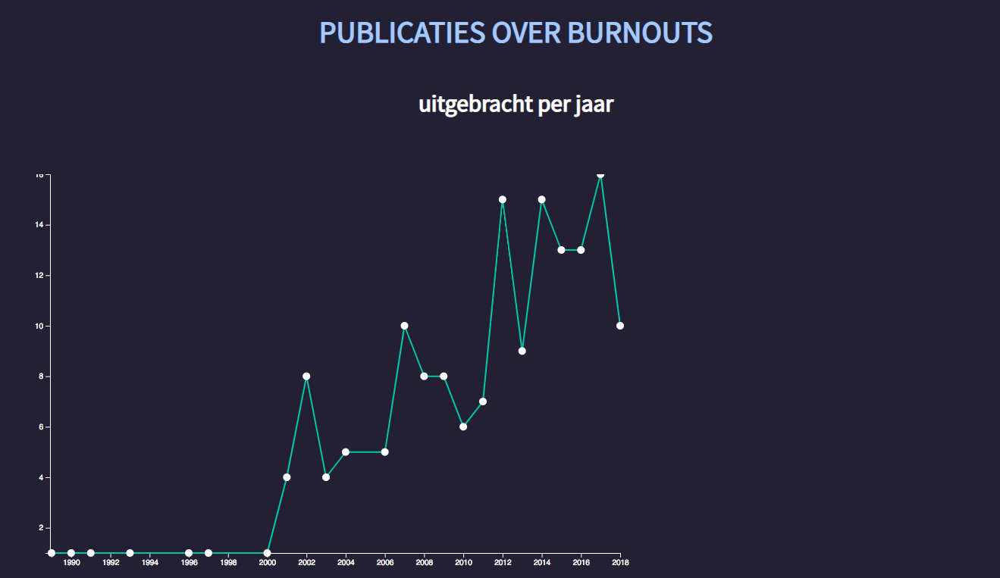

# Functional Programming



## Inleiding

Het toenemende aantal personen uit de Millenial generatie met burnout klachten, neemt ieder jaar weer toe. Het is op dit moment een veel besproken item en loop een willekeurige Bruna binnen en er ligt een stapeltje 'zelfhulp'boeken voor de millennial klaar. Ik was nieuwsgierig of er, dankzij de stijgende lijn van mensen met burnout klachten, er een toename in het aantal publicaties over het onderwerp burnout in de oba terug te vinden is.

[Bron](https://www.bnr.nl/podcast/werkverkenners/10354872/generatie-burn-out): podcast BNR nieuwsradio "de burnout generatie".

## Index

1. [Hypothese](#hypothese)

2. [Onderzoeksvraag](#onderzoeksvraag)

3. [Variabelen](#Variabelen)

4. [Schets](#schets)

5. [Code](#code)

   5.1[Installeren](#Installeren)

   5.2 [Uitvoering](#uitvoering)

   5.3 [D3](#D3)

6. [Todo](#todo)

7. [Proces](#proces)

8. [Shoutouts](#shoutouts)

## Hypothese

Sinds de komst van de millenials op de werkvloer is het aantal publicaties met het onderwerp "burnout" gestegen.

## Onderzoeksvraag

Wat is de invloed van het toenemende aantal burnouts onder de Millenials, op de hoeveelheid publicaties over het hebben van een Burnout.

## Variabelen

- Alle publicaties over het hebben van een burnout
- Alle publicaties over het onderwerp Burnout
- Het bijbehorende jaartal van een publicatie

## Schets

## Code

### Installeren

Om dit projet te installeren moet je een aantal dingen doen. Allereerst vraag je een key aan bij de [openbare bibliotheek Amsterdam](https://www.oba.nl/).

```# clone the repository
# Clone the reposity
https://github.com/Techdemo/functional-programming-resit.git

# change directory
cd functional-programming-resit

# create a .env file
touch env

# add public and secret to env file

#install dependencies
npm install

#to do requests on the api, enter your search query in the index.js and execute

Node .

# To see the visualisation itself execute

browser-sync start

```

### Uitvoering

Om data op te halen wordt er gebruik gemaakt van de Gissa Scraper (credits to Gijs Laarman). De Scraper maakt het voor mij gemakkelijk om data op te vragen met mijn search query, over meerdere pagina's in de api van de Oba. Wat de scraper van Gijs tof maakt is dat sturen van requests niet ineens gaat. Pagina's worden omstebeurt opgehaald. Wanneer pagina 1 klaar is, start pagina 2 pas met het sturen van een request.

Na het ophalen van de data heb ik een functie geschreven die alle opgehaalde data filtert op de property `Year` die `null` bevat. Die wil ik namelijk niet in mijn dataset.

```
  let data = res.data;

  const newArray = data.filter(d => {
    return d.Year && d.format !== null ? d : false;
  });

  return fs.writeFile("dataset.json", JSON.stringify(newArray), "utf8", () => {
    console.log("file written");
  });
```

De gefilterde array wordt naar een JSON bestand geschreven.

### D3

De dataset wordt vervolgens in mijn D3 bestand

`d3.json("dataset.json").then(data =>{.....})`

Met de `nest` functie van D3 zorg ik dat de data een bepaalde structuur gaat krijgen die goed werkt voor deze line chart.

```nest()
.key(data => data.Year)
.rollup(function(data){
return data.length;
})
.entries(data)
```

Om de line te tekenen over de punten die ik als scatterplot in mijn chart heb gezet, moest ik eerst de jaren sorteren. Hier kwam ik laat achter, tot die tijd leek het alsof een kleuter op mijn chart had gekrast.
Hier heb ik een tijdje over gedaan om dit te ontdekken. Eigenlijk is het vrij logisch dat je het pad moet vertellen wat de volgorde is.

```
bookNested.sort(function(a ,){
return a.key - b.key;
});
path
.data([bookNested])
.attr('fill', 'none')
.attr('stroke', '#00bfa5)
.attr('transform', 'translate(42,0)')
.attr('stroke-width', 2)
.attr('d', line);
});
```

de data moet in een array worden doorgestuurd naar de `line` functie.

## Todo

Zie mijn todo lijst [hier](https://github.com/Techdemo/functional-programming-resit/projects/1?add_cards_query=is%3Aopen)

## Proces

De eerste keer dat ik het van Functional-programming volgde, begreep ik er echt geen hout van. Ik had totaal geen idee hoe ik de data van de API nou netjes kon binnenhalen. Uiteindelijk is het mij wel gelukt maar door het gestoei had ik geen tijd meer om een D3 visualisatie te bouwen. Hierdoor kon mijn product niet beoordeelt worden.

Nu in de herkansing had ik wel beduidend meer het gevoel dat ik de stof onder de knie had. Dit kwam had te maken met een aantal zaken;

1. ik kon gebruik maken van de Gissa scraper (nogmaals, dankjewel Gijs Laarman). Dit scheelde veel tijd in het ophalen van data uit de API. Mijn vorige poging om data op te halen uit de api kun je [hier](https://github.com/Techdemo/functional-programming) vinden.
2. Het weekend voor de herkansing heb ik een aantal curssusen aangeschaft online en ben deze als een malle gaan doorspitten. Ik moest en zou d3 begrijpen!
3. Door front-end data had ik meer controle over het netjes structureren van mijn data. Ook wist ik wat ik nodig had om uit mijn dataset te halen.

Al met al, een super toffe ervaring en D3 is helemaal te gek. Ik kijk enorm uit naar de Dataweek om datavisualisatie te maken die wat meer vormgegeven is. Toevallig kwam ik [deze repo](https://github.com/gcalmettes/reveal.js-d3) tegen waar D3 gecombineerd werd met reveal.js. Super tof!

## Shoutouts

- Daniel van de Schuur
- Gijs Laarman
- [The Net Ninja](https://www.thenetninja.co.uk/)
